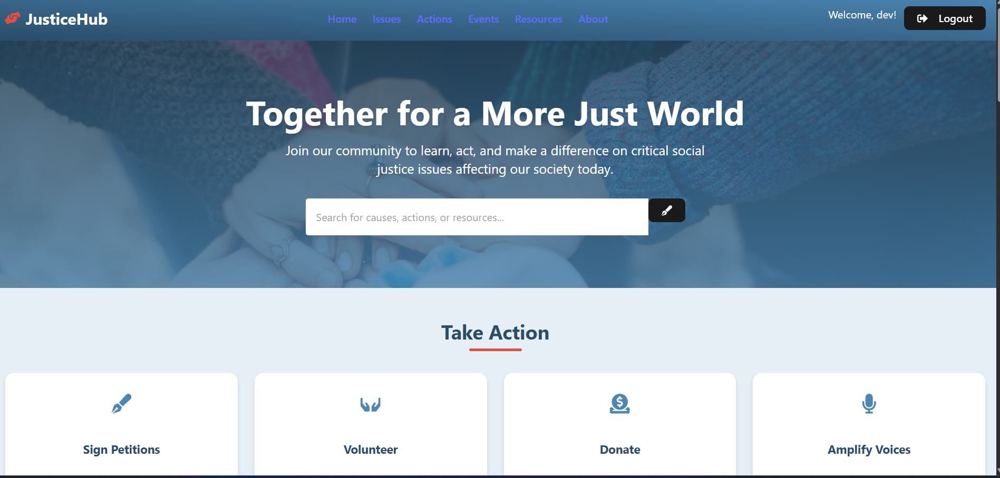
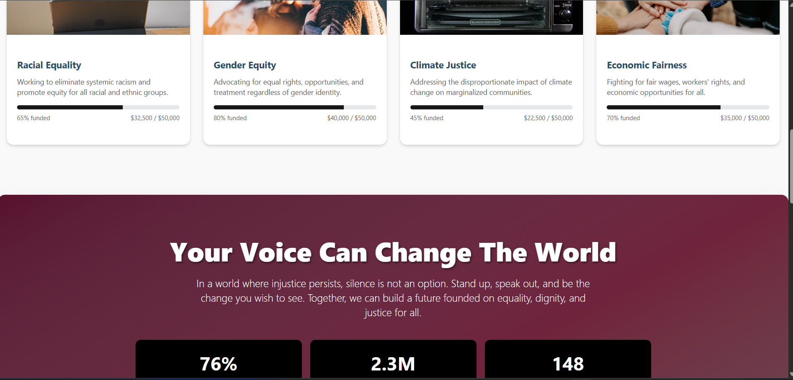

# Justice Hub

Justice Hub is a comprehensive full-stack platform dedicated to promoting social justice through education, community engagement, and actionable initiatives. It empowers users to learn about critical social issues, take meaningful actions, and connect with like-minded individuals working towards a more equitable world.

## Project Structure

This repository contains two main components:

### Frontend (JusticeHub1/)
A modern React application built with Vite, featuring:
- User authentication and authorization

- Interactive dashboard with search functionality

- Educational resources (articles, videos, podcasts, books, toolkits)
- Actionable items for social justice advocacy
- Responsive design with Tailwind CSS and Radix UI components


[View Frontend README](./JusticeHub1/README.md)

### Backend (Backend/)
A Node.js/Express API server providing:
- User authentication with JWT tokens
- MongoDB database integration
- RESTful API endpoints for user management
- CORS-enabled for frontend communication

## Quick Start

### Prerequisites
- Node.js (v16 or higher)
- MongoDB (local or Atlas)
- npm or yarn
- Docker & Docker Compose (optional, for containerized setup)

### Installation

#### Option 1: Local Development (Recommended for Development)

1. **Clone the repository:**
   ```bash
   git clone <repository-url>
   cd "Justice Hub1"
   ```

2. **Setup Backend:**
   ```bash
   cd Backend
   npm install
   # Create .env file with your MongoDB URI and JWT secret
   npm start
   ```

3. **Setup Frontend:**
   ```bash
   cd ../JusticeHub1
   npm install
   npm run dev
   ```

4. **Access the application:**
   - Frontend: http://localhost:5173
   - Backend API: http://localhost:3000

#### Option 2: Docker Compose (Recommended for Production/Testing)

1. **Clone the repository:**
   ```bash
   git clone <repository-url>
   cd "Justice Hub1"
   ```

2. **Start all services:**
   ```bash
   docker-compose up --build
   ```

3. **Access the application:**
   - Frontend: http://localhost:5173
   - Backend API: http://localhost:3000
   - MongoDB: localhost:27017

#### Option 3: Individual Docker Containers

**Backend:**
```bash
cd Backend
docker build -t justicehub-backend .
docker run -p 3000:3000 -e MONGODB_URI=your_mongo_uri -e JWT_SECRET=your_secret justicehub-backend
```

**Frontend:**
```bash
cd JusticeHub1
docker build -t justicehub-frontend .
docker run -p 5173:80 justicehub-frontend
```

## Features

- 🔐 Secure user authentication
- 🏠 Personalized dashboard
- 🔍 Real-time search across content
- 📚 Curated educational resources
- 📋 Actionable social justice initiatives
- 📱 Mobile-responsive design
- 🌐 External links to verified organizations

## Tech Stack

- **Frontend:** React 19, Vite, Tailwind CSS, Radix UI, Framer Motion
- **Backend:** Node.js, Express.js, MongoDB, Mongoose, JWT, bcrypt
- **Containerization:** Docker, Docker Compose
- **CI/CD:** GitHub Actions
- **Deployment:** Ready for Vercel/Netlify (frontend) and Heroku/Railway (backend)

## Deployment

### Docker Deployment

The project includes Docker configurations for easy deployment:

- **Backend Dockerfile:** Multi-stage Node.js container optimized for production
- **Frontend Dockerfile:** Multi-stage build with Nginx for serving static files
- **Docker Compose:** Orchestrates all services (frontend, backend, MongoDB) for local development

### CI/CD Pipeline

GitHub Actions workflow (`.github/workflows/ci.yml`) includes:
- Automated testing for both frontend and backend
- Docker image building and pushing to Docker Hub
- Deployment triggers for production environments

### Environment Variables

Create `.env` files in the respective directories:

**Backend (.env):**
```
MONGODB_URI=mongodb://localhost:27017/justicehub
JWT_SECRET=your-super-secret-jwt-key
NODE_ENV=production
```

**Frontend (.env):**
```
VITE_API_URL=http://localhost:3000
```

### Production Deployment Options

- **Frontend:** Vercel, Netlify, or any static hosting service
- **Backend:** Heroku, Railway, DigitalOcean App Platform
- **Database:** MongoDB Atlas or self-hosted MongoDB
- **Full Stack:** Docker containers on cloud platforms (AWS ECS, Google Cloud Run, etc.)

## Contributing

We welcome contributions! Please see the [Frontend README](./JusticeHub1/README.md) for detailed contribution guidelines.

## License

